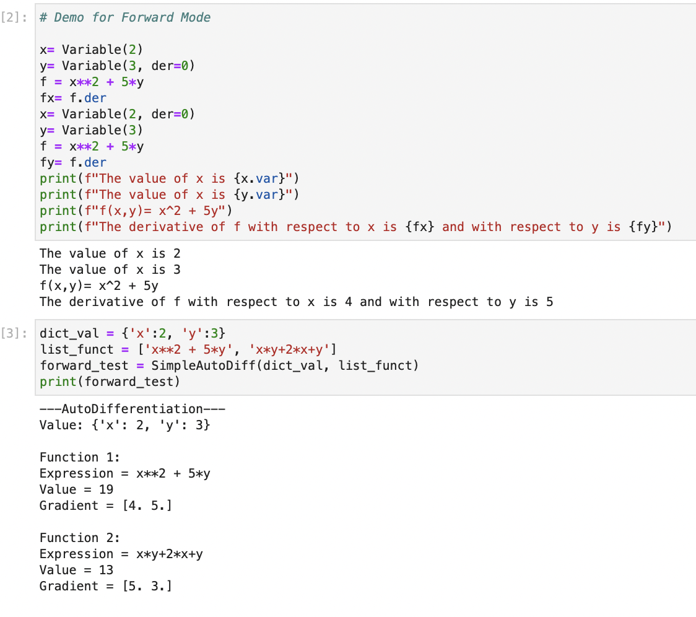
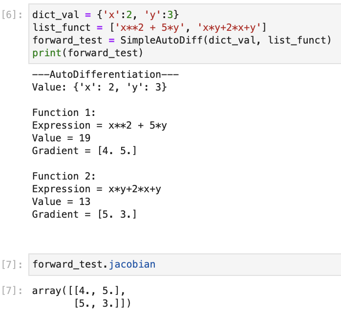
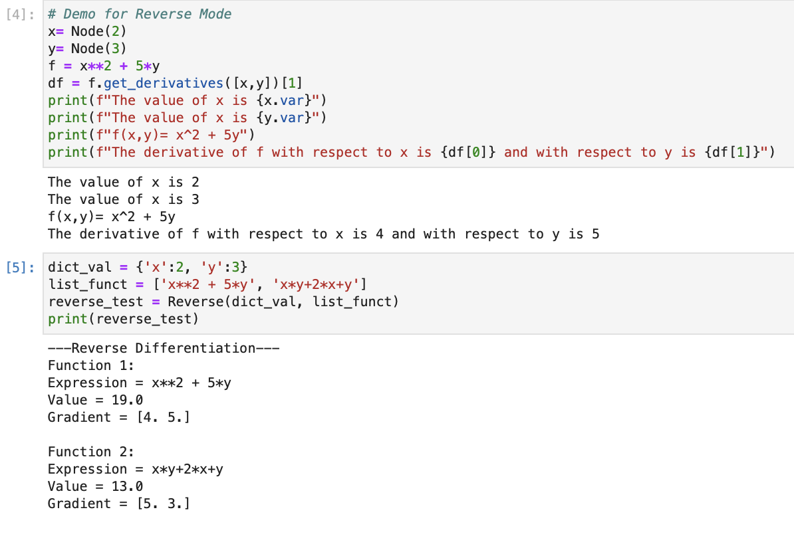

# Documentation

## Introduction

The software that we are going to build aims to achieve automatic differentiation. Finding the derivative of a function helps people understand the rate of change of a variable. In some real-life scenarios, we could compute the velocity of an object and make models to simulate and optimize the object movement. Automatic Differentiation (AD) could help speed up the derivative computation by applying chain rule iteratively and performing arithmetic operations. 

AD is derived from symbolic differentiation and numerical differentiation to mitigate the potential errors brought by those algorithms. Symbolic differentiation gives exact computation with variables taken into the expressions, which would take a lot of time to evaluate and there are also issues related to the order of operations and the feasibility of code implementation. Numerical differentiation estimates the derivative of a function using Newton's method to approximate the slope of a nearby secant line, but the rounding error also arises. Both of the differentiation methods need to derive the derivative of the original function as an intermediate step, but AD could directly decompose this process as a list of elementary functions and evaluate them with the same accuracy.

## Background

### Computational graph

Computational graph is a convenient way to represent mathematical expressions and visualize the process of evaluation. Each of the variables would be regarded as nodes in a graph, and the types of operations as edges connecting the nodes. The output of a pair of nodes would generate a new node, which would be used in the next steps of evaluation. It starts with the original variables and their derivatives as input nodes, and the goal is to build a graph and compute the target expression.
$$
\mbox{Example: } f(x) = (\sin x)^2
$$


### Chain rule

Chain rule is very useful in computing the derivative when the original expression is complicated. It decomposes the complex function into simple functions and then takes the derivative of a composite of them, the product is equivalent to the derivative of the original function. If $g$ is a function differentiable at $a$ and f is a function differentiable at $f(a)$, so the composite function $f \circ g$ is differentiable at $a$. 
$$
\frac{dy}{da} =\frac{dy}{dg}\frac{dg}{da}
$$

### Forward differentiation

In the chain rule introduced above, the forward differentiation was presented, where traversal starts from the original independent variables, computes the derivative, gets the expression of the inner function, and computes the derivative recursively. When there is more than one variable in the forward differentiation step, their derivatives need to be taken with respect to each variable once so that the gradient could be calculated correctly.

### Jacobian Matrix

The jacobian matrix contains the first-order partial derivatives with respect to each variable in the original function. The size of the jacobian matrix is $m$ by $n$, where $m$ is the number of functions to be taken derivatives, $n$ is the number of variables.

## How to use BlueKumquatAutoDiff Package

The user’s interactions with our package will be for educational and mathematical purposes as the use case of Automatic Differentiation is very flexible. Students can use our package to learn more about Automatic Differentiation and computational graphs. At-home users can use this package to solve basic differential equations like a calculator and companies can implement this package as a building block to conquer more complex differential equations. These are a few of the ways that users will interact with the BlueKumquatAutoDiff package. 

Our package is available on [Python Package Index (PyPI)](https://pypi.org/project/BlueKumquatAutoDiff/) and can be installed using this command:

```
pip install BlueKumquatAutoDiff
```

Alternatively, users can also clone our GitHub repository following the steps below:

1. Go to repository [cs107-blue-kumquat/cs107-FinalProject](https://github.com/cs107-blue-kumquat/cs107-FinalProject) and download our repository as a zip (or clone the repository) 

```
git clone https://github.com/cs107-blue-kumquat/cs107-FinalProject.git 
```

2. Unzip the files 
3. Change the Current working directory to the file containing setup.py using `cd`
4. Read the installation instructions 
5. Run `python setup.py install`

6. In your python file, put `from BlueKumquatAutoDiff.autodiff import *` at the top of the file.

For some elementary functions we are not going to use an existing package and we created the code of the derivatives for some elementary functions like trigonometric functions.

**Users can instantiate Forward AD objects by:** 

```python
dict_val = {'x': 1}
list_functs = ['x * 8', 'x + 3', 'log(x)', 'cos(x)', 'sqrt(x)', 'sinh(x)', 'arctan(x)']
auto_diff_test = SimpleAutoDiff(dict_val, list_functs)
```

Or by:

```python
dict_val = {'x':2, 'y':3}
list_funct = ['x**2 + 5*y', 'x*y+2*x+y']
forward_test = SimpleAutoDiff(dict_val, list_funct)
```

**Users can instantiate our new feature Reverse AD by:**

```python
dict_val = {'x': 1}
list_functs = ['x * 8', 'x + 3', 'log(x)', 'cos(x)', 'sqrt(x)', 'sinh(x)', 'arctan(x)']
auto_diff_test = Reverse(dict_val, list_functs)
```

Or by:

```python
dict_val = {'x':2, 'y':3}
list_funct = ['x**2 + 5*y', 'x*y+2*x+y']
forward_test = Reverse(dict_val, list_funct)
```

`dict_val` is a dictionary that contains the variable names and values. `list_functs` is a list of functions like $\sin$, $\cos$, $\log$ etc. to be evaluated and taken derivative to. The complete demo is in [demo.py](https://github.com/cs107-blue-kumquat/cs107-FinalProject/blob/luyu-dev/autodiff/demo.py).

## Software Organization

This software package is organized with the following hierarchy:


```
cs107-FinalProject\
			.github\
					workflows\
							workflow.yml
      BlueKumquatAutoDiff\
          tests\
              __init__.py
              test_autodiff.py
              test_reverse.py
              test_reverse_node.py
              test_simpleautodiff.py
          __init__.py
          autodiff.py
          demo.py
      docs\
      		documentation.md
          milestone1.md
          milestone2.md
          milestone2_progress.md
          Milestone2_Example.jpg
          Forward_Mode_Demo.png
          Forward_Mode_Demo2.png
          Reverse_Mode_Demo.png
      .gitignore
      .travis.yml
      LICENSE
      README.md
      requirements.txt
      setup.cfg
      setup.py
```

### Modules

- `autodiff.py`
  ​	This file contains classes `Variable`,  `Node`,  `SimpleAutoDiff`, and `Reverse` that evaluate a list of function expressions forwards or backwards, convert them to `Variable` objects, and compute the derivatives.

- `demo.py`
  ​	This is a demo that shows how to use `autodiff`.

### Test Suite
All tests for the functions that we implemented are in the file `test_autodiff.py`. As TravisCI has stopped working due to billing issue, we have switched to GitHub Action and connect Codecov to it to run the tests and show code coverage. The relevant badges are included in the [README.md](https://github.com/cs107-blue-kumquat/cs107-FinalProject/blob/luyu-dev/README.md) on the main project page.

### Installation

Package installation can be found in the **How to use BlueKumquatAutoDiff Package** section.

## Implementation

In this project we will create a package for automatic differentiation. Automatic differentiation is not the same as symbolic differentiation nor numerical differentiation. The forward mode of automatic differentiation applies the chain rule to each basic operation and the gradient is obtained by multiplying the individual pieces together. 

### What are the core data structures?

The core data structures are dependent on how we chose to implement the forward mode of automatic differentiation. We chose to implement the forward and reverse mode of automatic differentiation using dual numbers. In this implementation we used 4 classes. 
The core classes are:

- `Variable`
- `SimpleAutoDiff`
- `Node` 
- `Reverse`

#### The `Variable` Class:
We implemented forward mode using a dual numbers class called `Variable`, we created a class in the same manner we reviewed creating a class for complex variables in class that would store the real part of the value and can be accessed through attribute .var and the derivative through attribute .der (for example, with a dual number object $x$, `x.var` has the real value and `x.der` has the derivative of $x$, where if $x$ is a scalar, is just 1). This method of implementation allows us to store values for and access the real part and the dual part and allows us to adjust how operations would best be implemented to service our user.

Here are the functions that we have implemented in the forward mode. We used the `numpy` package to evaluate all elementary functions. 

- `__str__` 
- `__repr__`

##### Basic Operations

- `__add__`, `__radd__` (Addition)

- `__mul__`, `__rmul__` (Multiplication)
- `__sub__`, `__rsub__` (Subtraction)

- `__truediv__`, `__rtruediv__ `(Division)

- `__neg__` (Negation)
- `__abs__`
- `__pow__`, `__rpow__` (Power)

##### Comparison Operators

- `__lt__` (less than)
- `__gt__` (greater than)
- `__le__` (less than or equal to)
- `__ge__` (greater than or equal to)
- `__eq__` (equal to)
- `__ne__` (not equal to)

##### Elementary Functions

- `log` (Logarithms)
- `sqrt` (Square root)
- `exp` (Exponentials)
- `sin`,  `cos`, `tan` (Trig functions)
- `arcsin`,  `arccos`, `arctan ` (Inverse trig functions)
- `sinh`,  `cosh`, `tanh` (Hyperbolic functions)
- `logistic` (Logistic function)

#### The `SimpleAutoDiff` Class:

This class takes in inputs of a dictionary of variable names and their values, and a list of functions. The dictionary format takes in variable names as strings and their values. The list of functions takes in functions as strings. Within `SimpleAutoDiff`, the string and corresponding value are transformed to `Variable` objects that are used when each function is evaluated. 

The output of a `SimpleAutoDiff` object, if printed, would print the dictionary of values followed by the Function number, Expression, Function Value and Function Gradient for each function in the list of functions. 

*Below is an example of how a user might interact with the `Variable` class and the `SimpleAutoDiff` class*


The reason this class is called `SimpleAutoDiff` is because originally it only worked for functions of one variable however it can handle multiple functions of multiple variables.  We also implemented a jacobian attribute that would return a jacobian of size $n$ (representing the number of functions) by $m$ (representing the number of variables) that has the partial derivatives for each function with respect to each variable in the dictionary of variables. With this attribute users are able to use the jacobian from our class with Newton’s method and others. (See example of accessing jacobian)


#### The `Node` class:

We implemented reverse mode using a class very similar to our `Variable` class from forward mode. Like `Variable`, `Node` class was implemented in the same manner we reviewed creating a class for complex variables in class that would store the real part of the value and can be accessed through attribute `.var` and the derivative through attribute `.derivative` (which works if and only if `x.partials()` has been called).

What is different from our `Variable` class is that this class also has a list attribute `self.child_node`. Initialized as empty initially, the `child_node` attribute appends a tuple with the new `Node` object returned from function operations derivative of a variable with respect to the function for part of computing the function. Then our `partials` method computes the derivative of the variable by multiplying all of the stored partial derivatives in `child_node`. This method of implementation allows us to store values for and access the real part and store all derivatives for each part of the function so computing the derivative with respect to any variable is less computationally expensive than forward mode and more efficient. 

Here are the functions that we have implemented in the reverse mode. We used the `numpy` package to evaluate all elementary functions. 

- `__str__` 
- `__repr__`

##### Basic Operations

- `__add__`, `__radd__` (Addition)

- `__mul__`, `__rmul__` (Multiplication)
- `__sub__`, `__rsub__` (Subtraction)

- `__truediv__`, `__rtruediv__ `(Division)

- `__neg__` (Negation)
- `__abs__`
- `__pow__`, `__rpow__` (Power)

##### Comparison Operators

- `__lt__` (less than)
- `__gt__` (greater than)
- `__le__` (less than or equal to)
- `__ge__` (greater than or equal to)
- `__eq__` (equal to)
- `__ne__` (not equal to)

##### Elementary Functions

- `log` (Logarithms)
- `sqrt` (Square root)
- `exp` (Exponentials)
- `sin`,  `cos`, `tan` (Trig functions)
- `arcsin`,  `arccos`, `arctan ` (Inverse trig functions)
- `sinh`,  `cosh`, `tanh` (Hyperbolic functions)
- `logistic` (Logistic function)

#### The `Reverse` class:

This class takes in inputs of a dictionary of variable names and their values, and a list of functions. The dictionary format takes in variable names as strings and their values. The list of functions takes in functions as strings. Within `Reverse`, the string and corresponding value are transformed to `Node` objects that are used when each function is evaluated. 

The output of a `Reverse` object, if printed, would print the dictionary of values followed by the Function number, Expression, Function Value and Function Gradient for each function in the list of functions. 

*Below is an example of how a user might interact with the Node class and the `Reverse` class*

*Note how unlike in forward mode to get partial derivatives in the first half of the demo, that we did not have to initialize derivatives, the `get_derivatives` method gets partial derivatives with respect to each variable passed in.

## Extension Features

### The Jacobian Matrix

People with math backgrounds know the importance of being able to apply automatic differentiation to various problems. More specifically the usefulness of our package in terms of being able to export a jacobian matrix for our user. A jacobian matrix is a matrix of first order partial derivatives for a vector valued function. Since our implementation of forward mode uses a list of functions, this serves as a vector valued function. So the first feature we added was a `self.jacobian` method in order for a user to get and store a jacobian. This can be used in Newton’s method, to solve Nonlinear least squares problems, and in Statistical regression. 

### Reverse Mode

Originally our implementation of forward mode only supported single variable functions, e.g. $f(x)$. We updated it to include support for multivariate functions in December. We achieved this using a for loop where we were able to get derivatives for each variable in a function by setting the derivative of all other variables to $0$. This demonstrates the downfall of forward mode automatic differentiation as finding derivatives with respect to several variables is a much longer and complex process than finding derivatives for single variable functions 

#### Specific Cons of only using Forward Mode

- One potential disadvantage of forward mode automatic differentiation is that if we are going to calculate the partial derivatives of a function with respect to all variables.
- We would need to set the derivative to 1 for every one of them and compute the derivative one by one, which would take $\mathcal{O}(n)$ time.
- Even if we could try implementing it using **chain rule**, it would **not** make the program much faster.

#### Forward vs Reverse Mode: When to Use?

Our Recommendation to our package user is when there are only a few variables (more specifically 1 variable) in the function, forward mode automatic differentiation would be recommended because there are only few operations to be computed and the way it computes the derivatives is relatively straightforward. 

However, when there are **a lot of variables** in the function, **reverse** mode automatic differentiation would be recommended because there are only few operations to be computed if we take the derivative of the function backward. Reverse Mode prevents extra computation.

### Possible Future Additions

Some future work could include :

- Creating a **visualization feature** where a computational graph of all the nodes is generated in order to help the users visualize the process of evaluation. This would help differentiation be less of a black box to the users and might help newer users get used to the package and its applications. 
- Implementation of **Hessian or second order derivatives** in order to allow our users to evaluate more complex derivatives.
- Creating **website** to increase the publicity of our package that contains the use cases.

# Broader Impact and Inclusivity

Software that Computer Scientists develop have the potential to make a broader impact on society and the world around them. Potential uses for automatic differentiation include optimization for gradient descent for training neural networks. 

Neural Networks have the potential to be effectively applied to a variety of fields such as: Finance forecasting of stocks and currency or Language recognition for tone and voice recognition for customer interaction on digital consumer platforms.

However, people could misuse our software to create models that perpetuate historical prejudices and inequality in society. For example a misuse could be creating Neural Networks that Automate Criminal Sentencing rather than take a holistic approach or applications of Machine Learning for Increased Surveillance of people. 

In order to prevent misuse, our Inclusivity Statement is 

>  “*To educate potential future users of our software about the harmful ramifications of ignoring the ethical implications of Neural Networks, Machine Learning, and Optimization in order to create better, more equitable projects that utilize our package. To use machine learning to address systemic, socioeconomic, historic, and racial biases in society. And To make machine learning to a wide array of users from a diverse set of backgrounds*.”

**Diversity and Inclusion** in the field of computer science is important to our team: thus we have taken necessary steps to make sure our package is accessible to as many potential users as possible to ensure that people from all backgrounds are included in computing and have the proper tools to explore machine learning and optimization. We have chosen a **CopyLeft** software license because CopyLeft ensures that a program, as well as all of its modifications and extended versions, are free as well. Our **MIT license** as it is much more permissive and allows companies to make changes to the package and not be required to share these changes with the public.