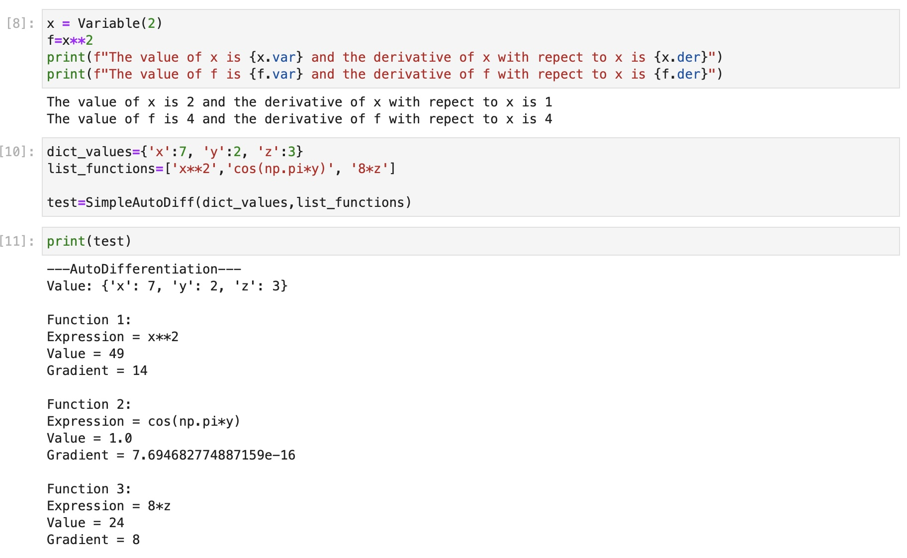

# Milestone 2 (as of 11/18/2021)

## Introduction

The software that we are going to build aims to achieve automatic differentiation. Finding the derivative of a function helps people understand the rate of change of a variable. In some real-life scenarios, we could compute the velocity of an object and make models to simulate and optimize the object movement. Automatic Differentiation (AD) could help speed up the derivative computation by applying chain rule iteratively and performing arithmetic operations. 

AD is derived from symbolic differentiation and numerical differentiation to mitigate the potential errors brought by those algorithms. Symbolic differentiation gives exact computation with variables taken into the expressions, which would take a lot of time to evaluate and there are also issues related to the order of operations and the feasibility of code implementation. Numerical differentiation estimates the derivative of a function using Newton's method to approximate the slope of a nearby secant line, but the rounding error also arises. Both of the differentiation methods need to derive the derivative of the original function as an intermediate step, but AD could directly decompose this process as a list of elementary functions and evaluate them with the same accuracy.

## Background

### Computational graph

Computational graph is a convenient way to represent mathematical expressions and visualize the process of evaluation. Each of the variables would be regarded as nodes in a graph, and the types of operations as edges connecting the nodes. The output of a pair of nodes would generate a new node, which would be used in the next steps of evaluation. It starts with the original variables and their derivatives as input nodes, and the goal is to build a graph and compute the target expression.
$$
\mbox{Example: } f(x) = (\sin x)^2
$$


### Chain rule

Chain rule is very useful in computing the derivative when the original expression is complicated. It decomposes the complex function into simple functions and then takes the derivative of a composite of them, the product is equivalent to the derivative of the original function. If $g$ is a function differentiable at $a$ and f is a function differentiable at $f(a)$, so the composite function $f · g$ is differentiable at $a$. 
$$
\frac{dy}{da} =\frac{dy}{dg}\frac{dg}{da}
$$

### Forward differentiation

In the chain rule introduced above, the forward differentiation was presented, where traversal starts from the original independent variables, computes the derivative, gets the expression of the inner function, and computes the derivative recursively. When there is more than one variable in the forward differentiation step, their derivatives need to be taken with respect to each variable once so that the gradient could be calculated correctly.

### Jacobian Matrix

The Jacobian matrix contains the first-order partial derivatives with respect to each variable in the original function. The size of the Jacobian matrix is m by n, where m is the number of functions to be taken derivatives, n is the number of variables.

## How to use AutomaticDifferentiation Package

The user’s interactions with our package will be for educational and mathematical purposes as the use case of Automatic Differentiation is very flexible. Students can use our package to learn more about Automatic Differentiation and computational graphs. At-home users can use this package to solve basic differential equations like a calculator and companies can implement this package as a building block to conquer more complex differential equations. These are a few of the ways that users will interact with the AutomaticDifferentiation package. 

As of now importing this package through Python Package Index PyPI is not available yet, and users could:

1. Go to repository blue kumquat and download our repository as a zip (or clone the repository) 

   ```git clone https://github.com/cs107-blue-kumquat/cs107-FinalProject.git ```

2. Unzip the files 

3. Change the Current working directory to the file containing setup.py using `cd`

4. Read the installation instructions 

5. Run `python setup.py install`

6. In your python file, put `from autodiff import *` at the top of the file.

For some elementary functions we are not going to use an existing package and we created the code of the derivatives for some elementary functions like trigonometric functions.

in order to import our package. For some elementary functions we are not going to use an existing package and we created the code of the derivatives for some elementary functions like trigonometric functions.

Users can instantiate AD objects by: 

```python
dict_val = {'x': 1}
list_functs = ['x * 8', 'x + 3', 'log(x)', 'cos(x)', 'sqrt(x)', 'sinh(x)', 'arctan(x)']
auto_diff_test = SimpleAutoDiff(dict_val, list_functs)
```

`dict_val` is a dictionary that contains the variable names and values. `list_functs` is a list of functions like sin, cos, log etc. to be evaluated and taken derivative to. The complete demo is in [demo.py](https://github.com/cs107-blue-kumquat/cs107-FinalProject/blob/luyu-dev/autodiff/demo.py).

## Software Organization

This software package is organized with the following hierarchy:

```
cs107-FinalProject\
			.github\
					workflows\
							workflow.yml
      autodiff\
          tests\
              __init__.py
              test_autodiff.py
          __init__.py
          autodiff.py
          demo.py
      docs\
          milestone1.md
          milestone2.md
          milestone2_progress.md
      .gitignore
      .travis.yml
      README.md
      LICENSE
      requirements.txt
      setup.py
```

### Modules

- `autodiff.py`

​	This file contains a class `Variable` and `SimpleAutoDiff` that evaluates a list of function expressions, convert them to `Variable` objects, and compute the derivatives. We overrode and implemented the following basic functions:

- `demo.py`

​	This is a demo that shows how to use `autodiff`.

### Test Suite

All tests for the functions that we implemented are in the file `test_autodiff.py`. As TravisCI has stopped working due to billing issue, we are currently switching to GitHub Action and connect Codecov to it to run the tests and show code coverage. The relevant badges are included in the [README.md](https://github.com/cs107-blue-kumquat/cs107-FinalProject/blob/luyu-dev/README.md) on the main project page.

### Installation

Package installation can be found in the **How to use AutomaticDifferentiation Package** section of the milestone2.md file.

## Implementation

In this project we will create a package for automatic differentiation. Automatic differentiation is not the same as symbolic differentiation nor numerical differentiation. The forward mode of automatic differentiation applies the chain rule to each basic operation and the gradient is obtained by multiplying the individual pieces together. 

### What are the core data structures?

The core data structures are dependent on how we chose to implement the forward mode of automatic differentiation. We chose to implement the forward mode of automatic differentiation using dual numbers.  In this implementation we used 2 classes.  

The core classes are:

- `Variable`

- `SimpleAutoDiff`

**The Variable Class:**

We implemented using a dual numbers class called Variable, we created a class in the same manner we reviewed creating a class for complex variables in class that would store the real part of the value and can be accessed through attribute .var  and the derivative through attribute .der (for example, with a dual number object x, x.var has the real value and x.der  has the derivative of x, where if x is a scalar, is just 1). This method of implementation allows us to store values for and access the real part and the dual part and allowed us to adjust how operations would best be implemented to service our user.


Here are the functions that we have implemented in the forward mode. We used `numpy` package to evaluate all elementary functions. 

- `__str__` 
- `__repr__`

##### Basic Operations

- `__add__`, `__radd__` (Addition)

- `__mul__`, `__rmul__` (Multiplication)
- `__sub__`, `__rsub__` (Subtraction)

- `__truediv__`, `__rtruediv__ `(Division)

- `__neg__` (Negation)
- `__abs__`
- `__pow__`, `__rpow__` (Power)

##### Comparison Operators

- `__lt__` (less than)
- `__gt__` (greater than)
- `__le__` (less than or equal to)
- `__ge__` (greater than or equal to)
- `__eq__` (equal to)
- `__ne__` (not equal to)

##### Elementary Functions

- `log` (Logarithms)
- `sqrt` (Square root)
- `exp` (Exponentials)
- `sin`,  `cos`, `tan` (Trig functions)
- `arcsin`,  `arccos`, `arctan ` (Inverse trig functions)
- `sinh`,  `cosh`, `tanh` (Hyperbolic functions)
- `logistic` (Logistic function)

**The SimpleAutoDiff Class:**

This class takes in inputs of a dictionary of variable names and their values, and a list of functions. The dictionary format takes in variable names as strings and their values. The list of functions takes in functions as strings.  Within SimpleAutoDiff, the string and corresponding value are transformed to Variable objects that are used when each function is evaluated. 

The output of a SimpleAutoDiff object if printed would print the dictionary of values followed by the Function number,  Expression, Function Value and Function Gradient for each function in the list of functions. 

*Below is an example of how a user might interact with the Variable class and the SimpleAutoDiff class*



The reason this class is called SimpleAutoDiff is because currently it only works for functions of one variable however it can handle multiple functions.  In the future we hope to further our class so it can handle functions of more than one variable and return the partial derivatives with respect to each variable.  We also hope to implement a Jacobian attribute that would return a Jacobian of size n (representing the number of functions) by m (representing the number of variables) that has the partial derivatives for each function with respect to each variable in the dictionary of variables.  With this attribute users would be able to use the Jacobian from our class with Newton’s method and others. 


## Future Features

### Multivariate function

As of now, our implementation only support single variable functions, e.g. $f(x)$. We plan to complete the implementation of multivariate function by mid-December 2021. To achieve this, we will need to add one more argument to the `Variable` class, called `seed`, which will specify the variable that we are goin to take derivative with respect to. In this case we would be able to work with vectors instead of scalars to evaluate the elementary functions. 

### Reverse Mode

One potential disadvantage of forward mode automatic differentiation is that if we are going to calculate the partial derivatives of a function with respect to all variables, we would need to set the seed to 1 for every of them and compute the derivative one by one, which would take $\mathcal{O}(n)$ time. Even if we could try implementing it using chain rule, it would not the program much faster.  When there are only a few variables in the function, forward mode automatic differentiation would be recommended because there are only few operations to be computed and the way it compute the derivatives it relatively straightforward. However, when there are a lot of variables in the function, reverse mode automatic differentiation would be recommended because there are only few operations to be computed if we take derivative of the function backward.

### Visualization (if time permitted)

We found the computational graph very helpful when learning the forward and reverse mode differentiation, and would hope to visualize the nodes and their relationship if time permitted. An example of the visualization is shown above in this doc.
